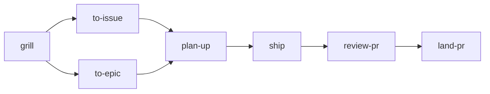

# skills

Agent skills for Claude Code and Codex, from planning an issue to a pull request that is ready to merge. The repo is for reading and borrowing: open a skill, read how it works, and take what helps you. There is no install support yet ([why](docs/adr/0002-read-and-borrow-only.md)). Each skill's README says what it needs.

## The flow

The main skills hand work to each other in this order.

## Skills

### Plan

| Skill | What it does |
|---|---|
| [grill](skills/grill/) | Interviews you on a plan or a design, one question at a time, and writes the glossary and ADRs as answers settle. |
| [capture](skills/capture/) | Files a raw idea or a bug you just saw as a small GitHub issue, so it is not lost. |
| [discover-path](skills/discover-path/) | Turns an idea too big for one grill into a map on GitHub: a parent issue whose child tickets are the questions to settle. |
| [diagnose](skills/diagnose/) | Finds the root cause of a bug, or the hot spot behind something slow, and stops there. |
| [improve-architecture](skills/improve-architecture/) | Finds shallow modules worth deepening, shows them in a visual report, then grills you on the one you pick. |
| [to-issue](skills/to-issue/) | Turns what the chat settled into one typed, sized GitHub issue an agent can pick up cold. |
| [to-epic](skills/to-epic/) | Cuts a large piece of work into a phased GitHub epic with native sub-issues and blocked-by edges. |
| [plan-up](skills/plan-up/) | Turns a ready issue, or a run of tickets, into a plan a coding agent can follow cold: seams, tests, slices, UI walks. |
| [create-mockup](skills/create-mockup/) | Builds a clickable HTML mock of a UI change inside your app's real shell, before anyone writes the real code. |
| [create-diagram](skills/create-diagram/) | Draws a diagram of your code as an interactive HTML page, built only from facts found in the code. |

### Build and ship

| Skill | What it does |
|---|---|
| [kickoff](skills/kickoff/) | Opens a new herdr pane and starts `/plan-up` there on an issue, a run of tickets, or an epic. |
| [ship](skills/ship/) | Takes an issue from plan to a pull request that is ready to merge, in one run. It never merges. |
| [handoff-devin](skills/handoff-devin/) | Sends the plan to a Devin cloud session and watches it until the PR is ready. |
| [handoff-cursor](skills/handoff-cursor/) | Sends the plan to a Cursor cloud agent and watches it until the PR is ready. |
| [make-commit](skills/make-commit/) | Writes a short Conventional Commits message for your staged change, focused on why. |
| [create-pr](skills/create-pr/) | Opens a pull request for the current branch, with a body that follows the repo's PR template. |
| [fix-conflicts](skills/fix-conflicts/) | Resolves a merge or rebase that stopped on conflicts, keeping what each side meant to do. |
| [land-pr](skills/land-pr/) | Takes an open pull request to ready-to-merge: judges every review comment, fixes, replies, and repeats. |

### Review and standards

| Skill | What it does |
|---|---|
| [review-pr](skills/review-pr/) | Reviews a pull request on three separate checks (logic, scope, standards), with your repo's own rules folded in. |
| [validate-pr-review](skills/validate-pr-review/) | Checks every finding in a review before you act on it: is it true, did this PR cause it, is it worth fixing. |
| [set-review-rules](skills/set-review-rules/) | Writes a `REVIEW.md` for your repo: the shared three-part review plus the rules only your repo needs. |
| [set-coding-standards](skills/set-coding-standards/) | Audits how your repo writes code, asks what you want, then writes `CODING_STANDARDS.md` and the tool configs. |
| [audit-coding-standards](skills/audit-coding-standards/) | Checks your code against the rules your repo says it follows, and reports what is outdated, broken, or missing. |

### Sessions

| Skill | What it does |
|---|---|
| [find-cc-session](skills/find-cc-session/) | Finds a past Claude Code session in this project from a rough description. |
| [find-co-session](skills/find-co-session/) | Finds a past Codex CLI session in this project from a rough description. |
| [load-cc](skills/load-cc/) | Pulls an earlier Claude Code session into this chat as a short state brief. |
| [load-co](skills/load-co/) | Pulls an earlier Codex CLI session into this chat as a short state brief. |

### Writing and search

| Skill | What it does |
|---|---|
| [write-for-agents](skills/write-for-agents/) | A reference for writing documents agents read: skills, `AGENTS.md`, `CLAUDE.md`. |
| [unslop](skills/unslop/) | Edits prose so it stops sounding like an AI wrote it. |
| [explain-again](skills/explain-again/) | Rewrites the agent's last answer in plain words, with the same meaning. |
| [semantic-code-search](skills/semantic-code-search/) | Finds code by what it does, with `semble`, before the agent falls back to grep. |
| [embed-source](skills/embed-source/) | Puts a library's full source next to your repo, at the version you install, so agents read real code. |

## Needs

- `gh`, signed in, for every skill that reads or writes GitHub issues and pull requests.
- `jq`, for the skills that call an API: [ship](skills/ship/), [kickoff](skills/kickoff/), [handoff-devin](skills/handoff-devin/), [handoff-cursor](skills/handoff-cursor/), [land-pr](skills/land-pr/).
- `python3`, for the skills that ship a script or build an HTML page.

Optional, only for the skills that name them:

- `herdr`, a terminal pane manager: [kickoff](skills/kickoff/), and [ship](skills/ship/) when it builds in a pane.
- Devin: [handoff-devin](skills/handoff-devin/), [ship](skills/ship/) on its cloud route, and Devin Review for [land-pr](skills/land-pr/).
- Cursor: [handoff-cursor](skills/handoff-cursor/).
- The `impeccable` skill: [create-mockup](skills/create-mockup/) and [create-diagram](skills/create-diagram/), to match your design system.
- `semble`: [semantic-code-search](skills/semantic-code-search/) and [embed-source](skills/embed-source/).

## Credits

Some skills copy or adapt skills from other repos. Each of those skill folders holds its upstream's `LICENSE`, and [THIRD_PARTY_NOTICES.md](THIRD_PARTY_NOTICES.md) lists every upstream with its license and commit. Skills that took only an idea thank their source in their own README.

## License

MIT, see [LICENSE](LICENSE). Copied and adapted files keep their upstream's license, as [THIRD_PARTY_NOTICES.md](THIRD_PARTY_NOTICES.md) lists.
