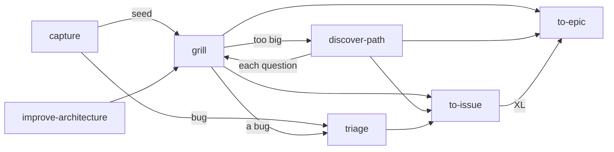
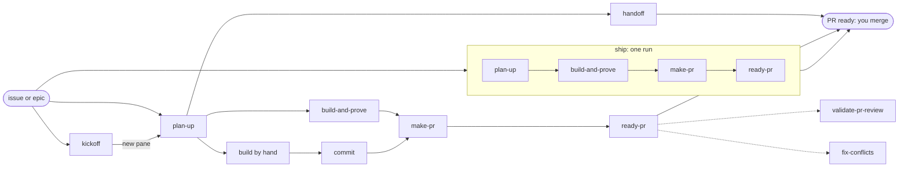

# skills

Agent skills for Claude Code and Codex, from planning an issue to a pull request that is ready to merge. The repo is for reading and borrowing: open a skill, read how it works, and take what helps you. There is no install support yet ([why](docs/adr/0002-read-and-borrow-only.md)). Each skill's README says what it needs.

## The flow

Work moves in two parts. First you settle what to do and write it as a GitHub issue. Then you build it and take the pull request to ready-to-merge. No skill merges; you do.

### 1. Settle the work

```mermaid
flowchart LR
  capture -->|seed| grill
  capture -->|bug| triage
  improve[improve-architecture] --> grill
  grill -->|a bug| triage
  grill -->|too big| discover[discover-path]
  discover -->|each question| grill
  grill --> toissue[to-issue]
  grill --> toepic[to-epic]
  discover --> toissue
  discover --> toepic
  triage --> toissue
  toissue -->|XL| toepic
```

- Start with [grill](skills/grill/) when you have a plan or a design to settle.
- [capture](skills/capture/) parks an idea or a bug as an issue for later. A seed grows through grill. A bug goes to [triage](skills/triage/), which finds the cause and writes the fix ticket.
- [discover-path](skills/discover-path/) takes work too big for one grill and splits it into questions, each one settled by grill.
- [improve-architecture](skills/improve-architecture/) finds code worth reshaping, then grills you on the part you pick.
- [create-mockup](skills/create-mockup/) and [create-diagram](skills/create-diagram/) help on the way, when the question is about a screen or about how the code is built.
- The work ends as one ticket from [to-issue](skills/to-issue/), or as a phased epic from [to-epic](skills/to-epic/).

### 2. Build and ship

```mermaid
flowchart LR
  ticket([issue or epic]) --> ship
  ticket --> kickoff
  ticket --> planup[plan-up]
  kickoff -->|new pane| planup
  subgraph ship [ship: one run]
    direction LR
    sp[plan-up] --> sb[build-and-prove] --> sm[make-pr] --> sr[ready-pr]
  end
  planup --> bp[build-and-prove] --> makepr
  planup --> ho[handoff]
  planup --> hand[build by hand]
  hand --> gitcommit[commit] --> makepr[make-pr] --> readypr[ready-pr]
  ship --> done([PR ready: you merge])
  ho --> done
  readypr --> done
  readypr -.-> vpr[validate-pr-review]
  readypr -.-> fc[fix-conflicts]
```

- [ship](skills/ship/) does the whole path in one run: plan, build and prove, open the PR, then ready it. Use it when you do not need to watch each step. It builds on your machine by default; add `devin` or `cursor` to build in the cloud.
- To go step by step, run [plan-up](skills/plan-up/) yourself, or [kickoff](skills/kickoff/) to start it in a new pane. Then give the plan to [build-and-prove](skills/build-and-prove/), which builds it with one proofbox Sandbox and films the walks; to [handoff](skills/handoff/), which sends it to Devin or Cursor; or build it by hand.
- After build-and-prove, [make-pr](skills/make-pr/) opens the PR with its proof folder. After a build by hand, [commit](skills/commit/) and [make-pr](skills/make-pr/) open the PR, and [ready-pr](skills/ready-pr/) takes it through review. ready-pr checks each review comment with [validate-pr-review](skills/validate-pr-review/) and fixes a stuck rebase with [fix-conflicts](skills/fix-conflicts/).
- [review-pr](skills/review-pr/) is a separate review you run by hand on any PR. [set-review-rules](skills/set-review-rules/) writes the `REVIEW.md` it reads.

## Skills

### Plan

| Skill | What it does |
|---|---|
| [grill](skills/grill/) | Interviews you on a plan or a design, one question at a time, and writes the glossary and ADRs as answers settle. |
| [capture](skills/capture/) | Files a raw idea or a bug you just saw as a small GitHub issue, so it is not lost. |
| [discover-path](skills/discover-path/) | Turns an idea too big for one grill into a map on GitHub: a parent issue whose child tickets are the questions to settle. |
| [triage](skills/triage/) | Finds the root cause of a bug, or the hot spot behind something slow, then turns the bug into a fix ticket. |
| [improve-architecture](skills/improve-architecture/) | Finds shallow modules worth deepening, shows them in a visual report, then grills you on the one you pick. |
| [to-issue](skills/to-issue/) | Turns what the chat settled into one typed, sized GitHub issue an agent can pick up cold. |
| [to-epic](skills/to-epic/) | Cuts a large piece of work into a phased GitHub epic with native sub-issues and blocked-by edges. |
| [plan-up](skills/plan-up/) | Turns a ready issue, or a run of tickets, into a plan a coding agent can follow cold: seams, tests, slices, doc updates, UI walks. |
| [create-mockup](skills/create-mockup/) | Builds a clickable HTML mock of a UI change inside your app's real shell, before anyone writes the real code. |
| [create-diagram](skills/create-diagram/) | Draws a diagram of your code as an interactive HTML page, built only from facts found in the code. |

### Build and ship

| Skill | What it does |
|---|---|
| [kickoff](skills/kickoff/) | Opens a new herdr pane and starts `/plan-up` there on an issue, a run of tickets, or an epic. |
| [ship](skills/ship/) | Takes an issue from plan to a pull request that is ready to merge, in one run. It never merges. |
| [build-and-prove](skills/build-and-prove/) | Builds a plan on your machine with one proofbox Sandbox for every test and the app, and has a walker film the UI walks as proof. |
| [handoff](skills/handoff/) | Sends the plan to a Devin session or a Cursor cloud agent and watches it until the PR is ready. |
| [commit](skills/commit/) | Writes a short Conventional Commits message for your staged change, focused on why. |
| [make-pr](skills/make-pr/) | Opens a pull request in the same shape as every PR these skills make, with build-and-prove's screenshots and videos when given its proof folder. |
| [fix-conflicts](skills/fix-conflicts/) | Resolves a merge or rebase that stopped on conflicts, keeping what each side meant to do. |
| [ready-pr](skills/ready-pr/) | Takes an open pull request to ready-to-merge: judges every review comment, fixes, replies, and repeats. |
| [prune-worktrees](skills/prune-worktrees/) | Removes the worktrees whose PRs are merged, with their branches, and lists every other worktree with the reason it stays. |

### Review and standards

| Skill | What it does |
|---|---|
| [review-pr](skills/review-pr/) | Reviews a pull request on three separate checks (logic, scope, standards), with your repo's own rules folded in. |
| [validate-pr-review](skills/validate-pr-review/) | Checks every finding in a review before you act on it: is it true, did this PR cause it, is it worth fixing. |
| [set-review-rules](skills/set-review-rules/) | Writes a `REVIEW.md` for your repo: the shared three-part review plus the rules only your repo needs. |
| [set-coding-standards](skills/set-coding-standards/) | Makes your repo's first `CODING_STANDARDS.md`: researches your stack, reads your code, asks what you want, then writes the file and the tool configs. |
| [audit-coding-standards](skills/audit-coding-standards/) | Checks your `CODING_STANDARDS.md` against your code and current docs, asks how to fix what is outdated, broken, or missing, then writes the changes. |
| [retro](skills/retro/) | Reads one session or many, finds where the agent struggled, and turns what repeats into fixes to its environment: checks, pointers, review rules, skills. |

### Sessions

| Skill | What it does |
|---|---|
| [find-cc-session](skills/find-cc-session/) | Finds a past Claude Code session in this project from a rough description. |
| [find-co-session](skills/find-co-session/) | Finds a past Codex CLI session in this project from a rough description. |
| [load-cc-session](skills/load-cc-session/) | Pulls an earlier Claude Code session into this chat as a short state brief. |
| [load-co-session](skills/load-co-session/) | Pulls an earlier Codex CLI session into this chat as a short state brief. |

### Writing and search

| Skill | What it does |
|---|---|
| [write-for-agents](skills/write-for-agents/) | A reference for writing documents agents read: skills, `AGENTS.md`, `CLAUDE.md`. |
| [unslop](skills/unslop/) | Edits prose so it stops sounding like an AI wrote it. |
| [explain-again](skills/explain-again/) | Rewrites the agent's last answer in plain words, with the same meaning. |
| [semantic-code-search](skills/semantic-code-search/) | Finds code by what it does, with `semble`, before the agent falls back to grep. |
| [embed-source](skills/embed-source/) | Puts a library's full source next to your repo, at the version you install, so agents read real code. |

## Needs

- `gh`, signed in, for every skill that reads or writes GitHub issues and pull requests.
- `jq`, for the skills that call an API: [ship](skills/ship/), [kickoff](skills/kickoff/), [handoff](skills/handoff/), [ready-pr](skills/ready-pr/).
- `python3`, for the skills that ship a script or build an HTML page.

Optional, only for the skills that name them:

- `herdr`, a terminal pane manager: [kickoff](skills/kickoff/), and [build-and-prove](skills/build-and-prove/) when it builds in a pane.
- proofbox: [build-and-prove](skills/build-and-prove/), and [ship](skills/ship/) on its local route.
- Devin: [handoff](skills/handoff/), [ship](skills/ship/) when you name it, and Devin Review, or another review tool, for [ready-pr](skills/ready-pr/).
- Cursor: [handoff](skills/handoff/).
- The `impeccable` skill: [create-mockup](skills/create-mockup/) and [create-diagram](skills/create-diagram/), to match your design system.
- `semble`: [semantic-code-search](skills/semantic-code-search/) and [embed-source](skills/embed-source/).

## Credits

Some skills copy or adapt skills from other repos. Each of those skill folders holds its upstream's `LICENSE`, and [THIRD_PARTY_NOTICES.md](THIRD_PARTY_NOTICES.md) lists every upstream with its license and commit. Skills that took only an idea thank their source in their own README.

## License

MIT, see [LICENSE](LICENSE). Copied and adapted files keep their upstream's license, as [THIRD_PARTY_NOTICES.md](THIRD_PARTY_NOTICES.md) lists.
